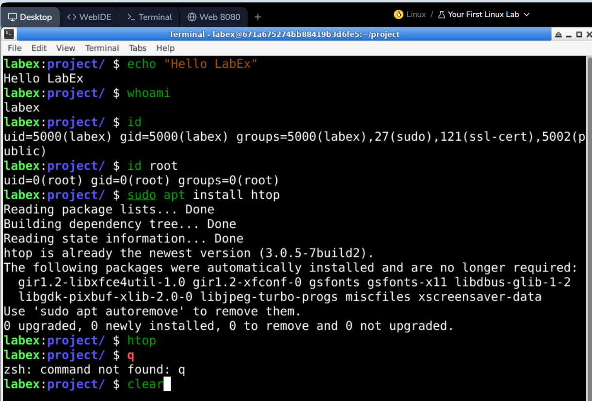
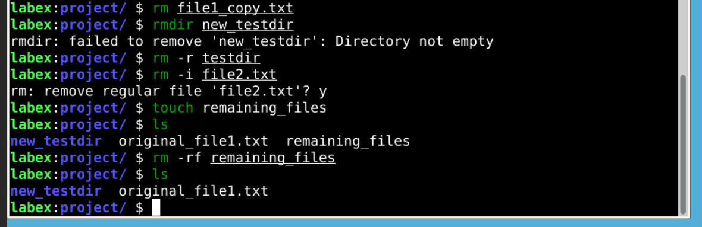
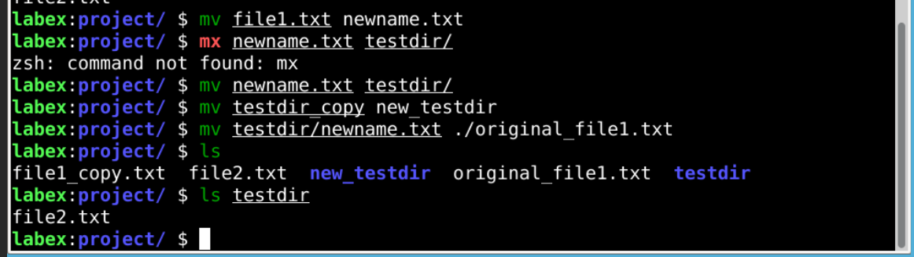
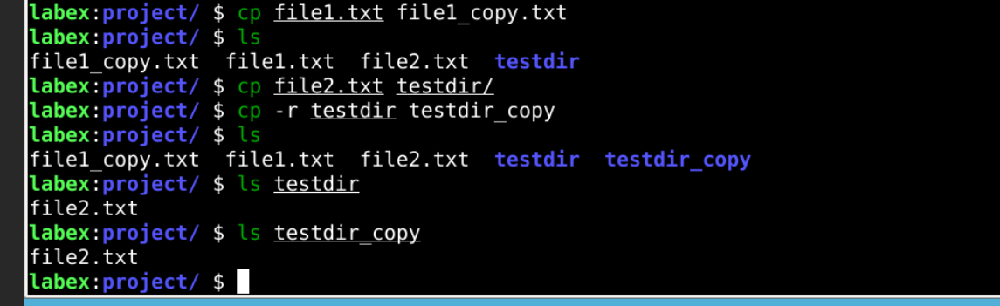
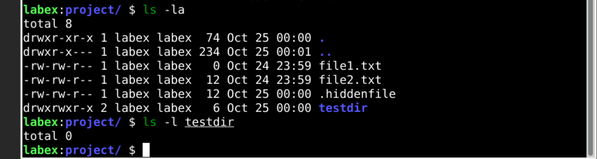
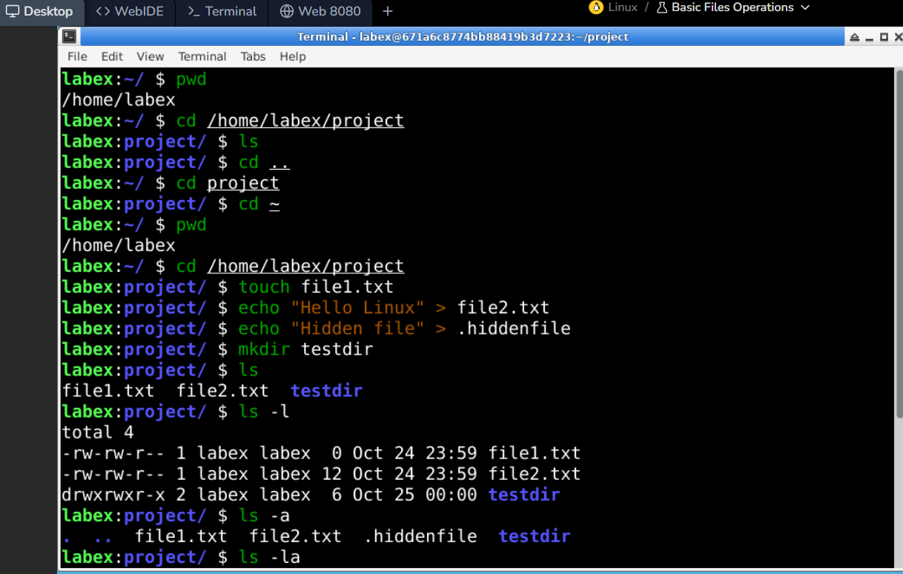

# linux_session_01

### **first lab**

1. How to open and use the terminal
2. How to use the `echo` command to make your computer "speak"
3. How to find out your username with `whoami`
4. How to get detailed user information with `id`
5. How to install software using `sudo apt install`
6. How to monitor your system with `htop`
7. How to clear your terminal screen

---

### **basic file operations**

- Navigating the file system with `cd` and `pwd`
- Creating files and directories with `touch` and `mkdir`
- Listing contents with `ls` and its options
- Copying files and directories with `cp`
- Moving and renaming with `mv`
- Removing files and directories with `rm` and `rmdir`

